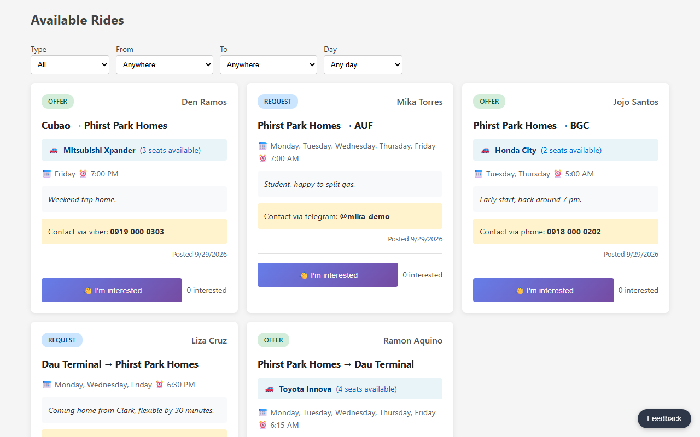
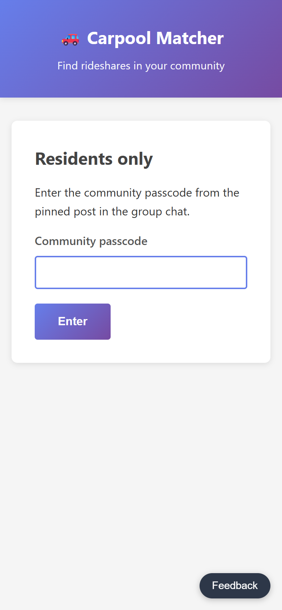
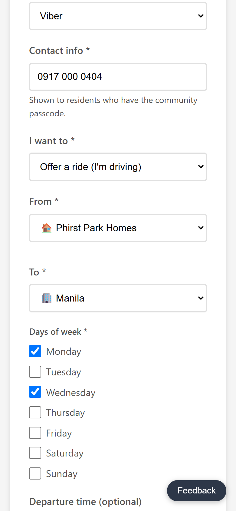
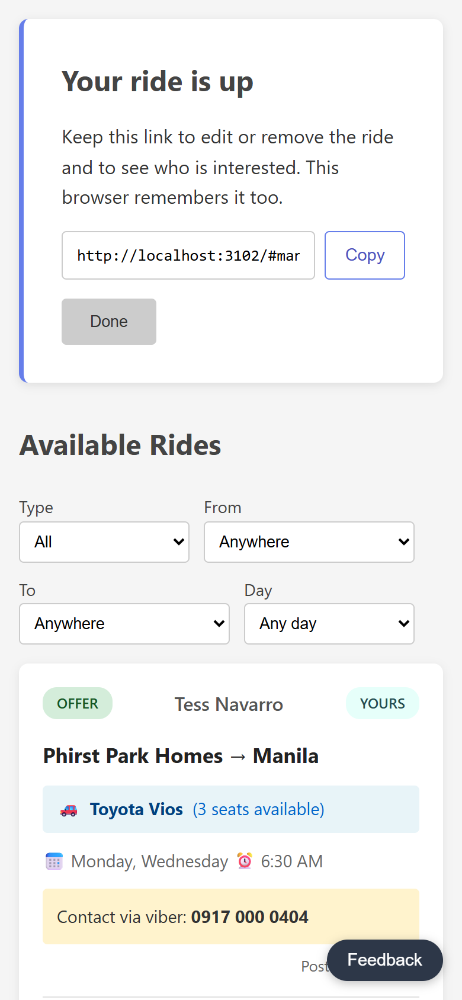
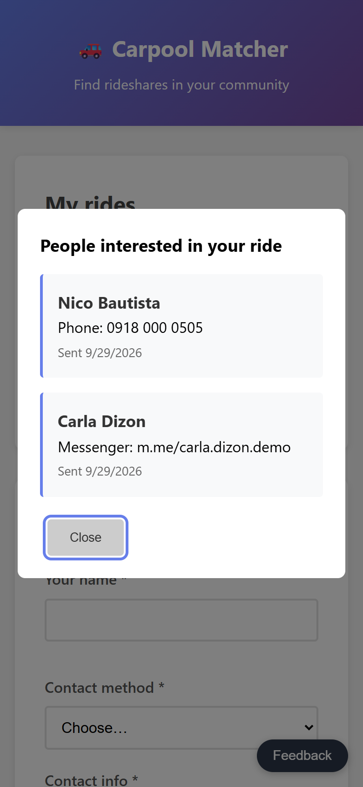

# Carpool board

A ride board for Phirst Park Homes residents, built to replace scrolling the
community group chat for "anyone going to Dau at 6?". Residents post ride
offers and requests (route, days, time, seats); other residents browse,
filter, and either contact the poster directly or tap "I'm interested".



On a phone: the passcode screen, posting a ride, the private manage link
shown once after posting, and the poster's list of interested riders.

<p>
  
  
  
  
</p>

Screenshots are from a local run on 2026-09-29 with made-up residents.

## How it works

- The board sits behind one shared passcode (`COMMUNITY_PASSCODE`), posted in
  the group chat. Entering it once sets a signed cookie for 180 days, and
  changing the passcode signs everyone out.
- There are no accounts. Posting a ride returns a private manage link
  (`/#manage=<id>.<token>`), which this browser remembers under "My rides" and
  which works on any device. Only that link can edit, renew or remove the
  ride, or see who is interested. The server stores a SHA-256 of the token,
  not the token.
- "I'm interested" sends your name and contact to the poster only.
- Posts drop off after 60 days unless the poster renews them.
- A Feedback button on every page saves to the `feedback` table and can also
  post to a Discord channel.

## Stack

Node 20+, Express 4, PostgreSQL (`pg`), plain HTML/CSS/JS in `public/`.
Hosted on Vercel (zero-config Express: `app.js` exports the app, `public/` is
served from the CDN) with Neon Postgres. Production builds run `npm run build`,
which applies pending migrations before the new code goes live; preview and
local builds skip that step.

## Local development

```bash
npm install
cp .env.example .env         # DATABASE_URL at minimum
npm run db:migrate           # applies db/migrations/*.sql
npm run dev                  # http://localhost:3000
```

| Variable | Required | Purpose |
|----------|----------|---------|
| `DATABASE_URL` | yes | Postgres connection string |
| `COMMUNITY_PASSCODE` | in production | Residents' passcode; unset = public board |
| `FEEDBACK_WEBHOOK_URL` | no | Discord webhook for feedback |

## Tests

```bash
npm test
```

Vitest + Supertest against PGlite (Postgres compiled to WASM) with the real
migration applied; no database server needed. GitHub Actions runs them on
every push and pull request.

## API

| Method | Path | Who |
|--------|------|-----|
| GET | `/api/session` | anyone: `{ member, gate }` |
| POST | `/api/join` | anyone: `{ passcode }` → member cookie (10 tries / 15 min / IP) |
| POST | `/api/leave` | clears the cookie |
| GET | `/api/rides` | members |
| POST | `/api/rides` | members (10 / hour / IP) → `{ post_id, manage_token }` |
| PUT | `/api/rides/:id` | manage token (`X-Manage-Token`); `{ days_of_week, departure_time, notes, vehicle_model, available_seats, renew }` |
| DELETE | `/api/rides/:id` | manage token |
| GET | `/api/rides/:id/interests` | manage token |
| POST | `/api/rides/:id/interests` | members (20 / hour / IP) |
| GET / POST | `/api/locations` | members (POST 10 / hour / IP) |
| POST | `/api/feedback` | anyone (5 / hour / IP) |
| GET | `/api/health` (`?db=1`) | anyone |

Deployment steps and the September 2026 audit: [docs/PRODUCTION_READINESS.md](docs/PRODUCTION_READINESS.md).

## License

MIT
