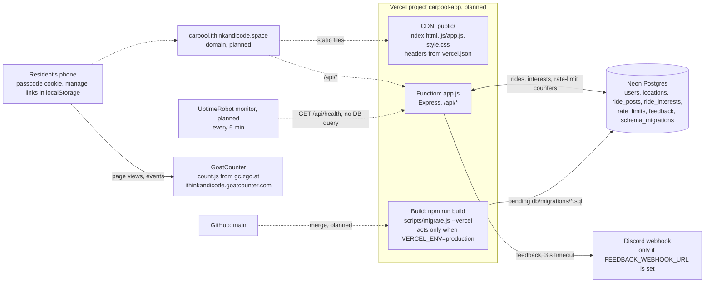
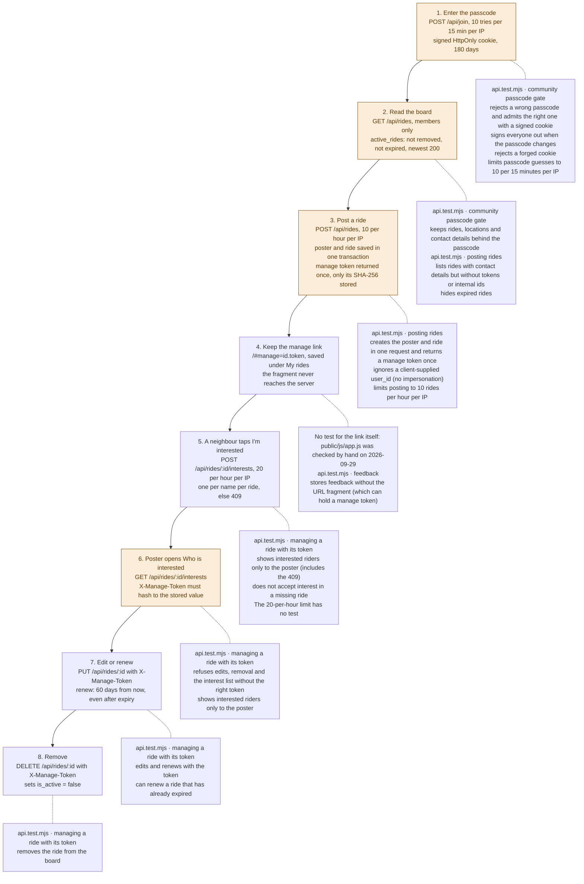

# Carpool board

A ride board for Phirst Park Homes residents, built to replace scrolling the
community group chat for "anyone going to Dau at 6?". Residents post ride
offers and requests (route, days, time, seats); other residents browse,
filter, and either contact the poster directly or tap "I'm interested".


On a phone: the passcode screen, posting a ride, the private manage link
shown once after posting, and the poster's list of interested riders.

<p>
  
  
  
  
</p>

Screenshots are from a local run on 2026-09-29 with made-up residents.

## How it works

- The board sits behind one shared passcode (`COMMUNITY_PASSCODE`), posted in
  the group chat. Entering it once sets a signed cookie for 180 days, and
  changing the passcode signs everyone out.
- There are no accounts. Posting a ride returns a private manage link
  (`/#manage=<id>.<token>`), which this browser remembers under "My rides" and
  which works on any device. Only that link can edit, renew or remove the
  ride, or see who is interested. The server stores a SHA-256 of the token,
  not the token.
- "I'm interested" sends your name and contact to the poster only.
- Posts drop off after 60 days unless the poster renews them.
- A Feedback button on every page saves to the `feedback` table and can also
  post to a Discord channel.

## How the system fits together

Two diagrams: first the parts of production and how they connect, then one
resident's path through the app with the tests that enforce each step pinned
to it. (Mermaid: renders on GitHub; VS Code's preview needs the "Markdown
Preview Mermaid Support" extension.)



Two arrows carry most of the story. Everything the phone asks for beyond the
static page goes to the Express function in `app.js`, and apart from the
passcode cookie (an HMAC check in `lib/membership.js`), what it decides comes
from Neon. That includes the per-IP rate limits: their counters live in
`rate_limits` because serverless instances share no memory. The other
is the build arrow. Merging to main will run `scripts/migrate.js --vercel`,
which applies pending migrations before the new code goes live, and a failed
migration stops the deploy. Only the feedback webhook and GoatCounter (loaded
by the browser, not the server) talk to outside services.

Nothing runs on Vercel yet. The project, the domain (the one the runbook
suggests) and the UptimeRobot monitor are the planned parts, so their arrows
are dashed; `docs/PRODUCTION_READINESS.md` has the steps to set them up.



Amber marks the four steps where access is handed out or residents' contact
details leave the server. Step 1 sets the cookie that opens everything else.
Step 2 sends every active poster's name and contact details to any member.
Step 3 returns the manage token, the only credential for that ride, and the
server keeps no copy it could show again. Step 6 sends interested riders'
contact details, and only to whoever holds that token.

Mappings the boxes can't show: every `/api/rides` route also needs the cookie
from step 1, so a manage link opened in a browser that hasn't entered the
passcode shows the gate first; the page saves the link to My rides before it
checks the session, so the ride is there after joining. Changing
`COMMUNITY_PASSCODE` cancels step 1's cookies but not step 3's tokens. The
limits in steps 1, 3 and 5 share the `rate_limits` table, keyed by bucket
(`join`, `post-ride`, `interest`) and the `x-real-ip` address, so a household
on one connection shares them, and
they let requests through if the database check fails. Expiry spans steps 2
and 7: after 60 days `active_rides` hides the post but the token still works,
so renewing brings it back, whereas step 8 is final (renewing a removed ride
returns 404).

## Stack

Node 20+, Express 4, PostgreSQL (`pg`), plain HTML/CSS/JS in `public/`.
Hosted on Vercel (zero-config Express: `app.js` exports the app, `public/` is
served from the CDN) with Neon Postgres. Production builds run `npm run build`,
which applies pending migrations before the new code goes live; preview and
local builds skip that step.

## Local development

```bash
npm install
cp .env.example .env         # DATABASE_URL at minimum
npm run db:migrate           # applies db/migrations/*.sql
npm run dev                  # http://localhost:3000
```

| Variable | Required | Purpose |
|----------|----------|---------|
| `DATABASE_URL` | yes | Postgres connection string |
| `COMMUNITY_PASSCODE` | in production | Residents' passcode; unset = public board |
| `FEEDBACK_WEBHOOK_URL` | no | Discord webhook for feedback |

Schema changes go in a new `db/migrations/00N_name.sql`, written to be
re-runnable; production builds apply it. Tests only see an empty database, so
before merging a pull request that adds a migration, dry-run it on a Neon
branch of production (steps in `docs/PRODUCTION_READINESS.md`, "Changing the
schema after launch"). Neon access is Alfie's: ask Alfie to run it and paste
the output into the pull request.

## Tests

```bash
npm test
```

Vitest + Supertest against PGlite (Postgres compiled to WASM) with the real
migration applied; no database server needed. `test/migrate.test.mjs` covers
the migration runner itself: bookkeeping, rollback on failure, and the
production-only gate in the build step. GitHub Actions is turned off for
this repo, so run them locally before merging. `.github/workflows/ci.yml`
runs them again if Actions is turned back on.

## API

| Method | Path | Who |
|--------|------|-----|
| GET | `/api/session` | anyone: `{ member, gate }` |
| POST | `/api/join` | anyone: `{ passcode }` → member cookie (10 tries / 15 min / IP) |
| POST | `/api/leave` | clears the cookie |
| GET | `/api/rides` | members |
| POST | `/api/rides` | members (10 / hour / IP) → `{ post_id, manage_token }` |
| PUT | `/api/rides/:id` | manage token (`X-Manage-Token`); `{ days_of_week, departure_time, notes, vehicle_model, available_seats, renew }` |
| DELETE | `/api/rides/:id` | manage token |
| GET | `/api/rides/:id/interests` | manage token |
| POST | `/api/rides/:id/interests` | members (20 / hour / IP) |
| GET / POST | `/api/locations` | members (POST 10 / hour / IP) |
| POST | `/api/feedback` | anyone (5 / hour / IP) |
| GET | `/api/health` (`?db=1`) | anyone |

Deployment steps and the September 2026 audit: [docs/PRODUCTION_READINESS.md](docs/PRODUCTION_READINESS.md).

## License

MIT
